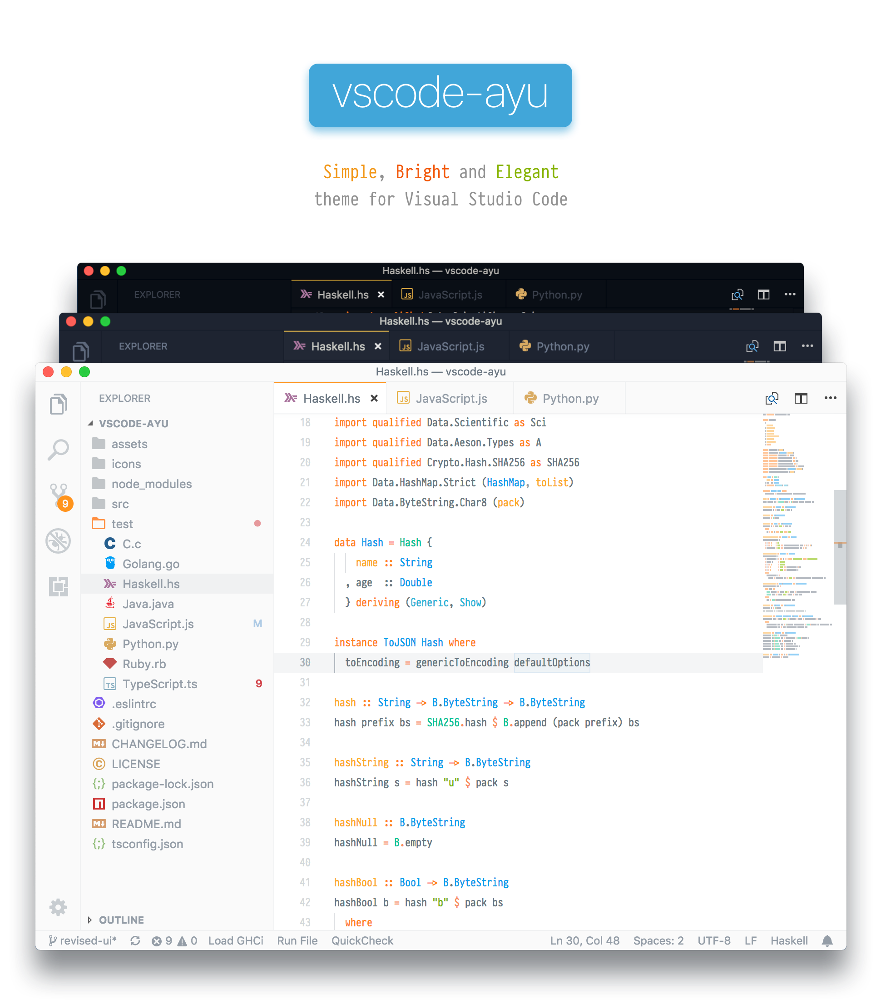
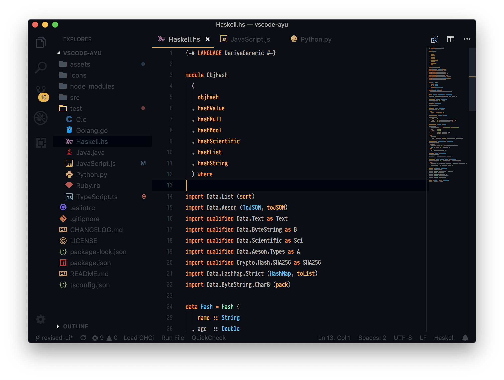
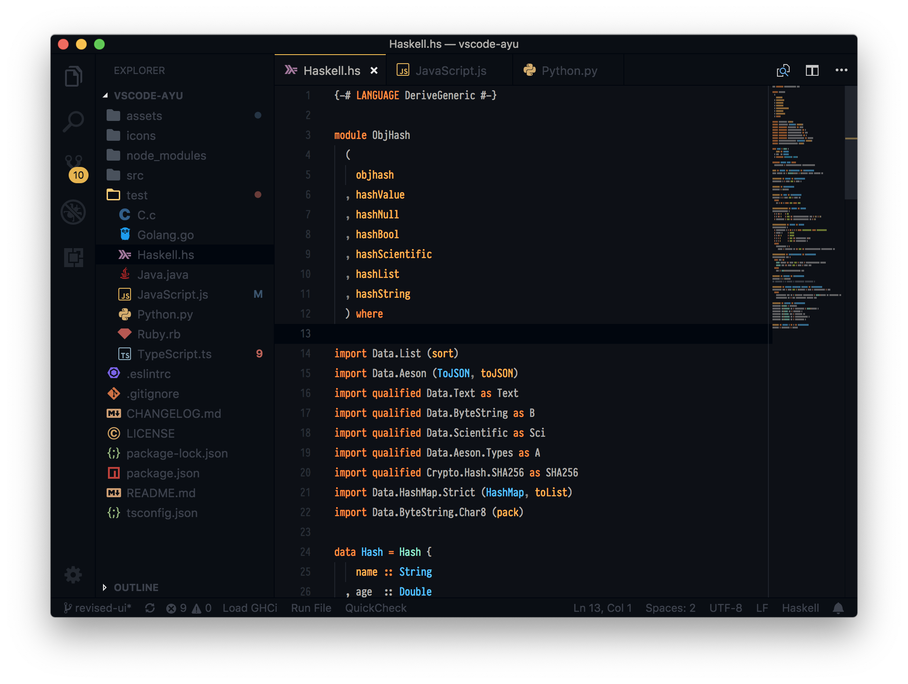

> Forked from: https://github.com/ayu-theme/vscode-ayu
> Original source from: https://github.com/dempfi/ayu

This is a high contrast dark variant of the original Ayu theme for Visual Studio Code.

> This project is not maintained by the original Ayu theme author [Ayu theme](https://github.com/dempfi/ayu). Please report issues related to this version here only if they concern this fork specifically.

Additionally, this fork exists for my own personal customisation and preference; unrelated feedback or requests may be disregarded, however, if you have any issues related specifically to this fork, I will happily take issue reports / pull requests.

## Install

This project is not currently on the marketplace. To install:

1. Download the repository (zip or clone)
2. Open the terminal and run `vsce package`
3. Go to "Extensions" tab, and select "Install from VSIX"
4. Select the newly created package (located in the code directory)

## Screenshots

#### Dark




## Development

Install dependencies

```shell
npm install
```

Update themes and build VSIX package

```shell
npm run build && npm run package
```

Build package locally to install

```shell
vsce package
```
